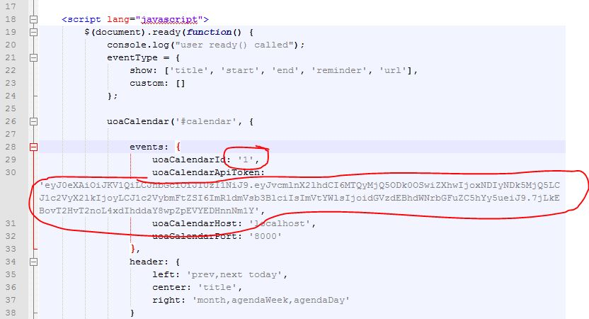

After you have download the package at:

https://github.com/UoA-CompSci/fullcalendar-uoa-ui/raw/master/scripts.zip

and unzipped the package, you must add your key and calendar id to the simple.html to access your calendar.

on line 29 replace the '1' with your calendar number 
on line 20 replace the Token with your Token

